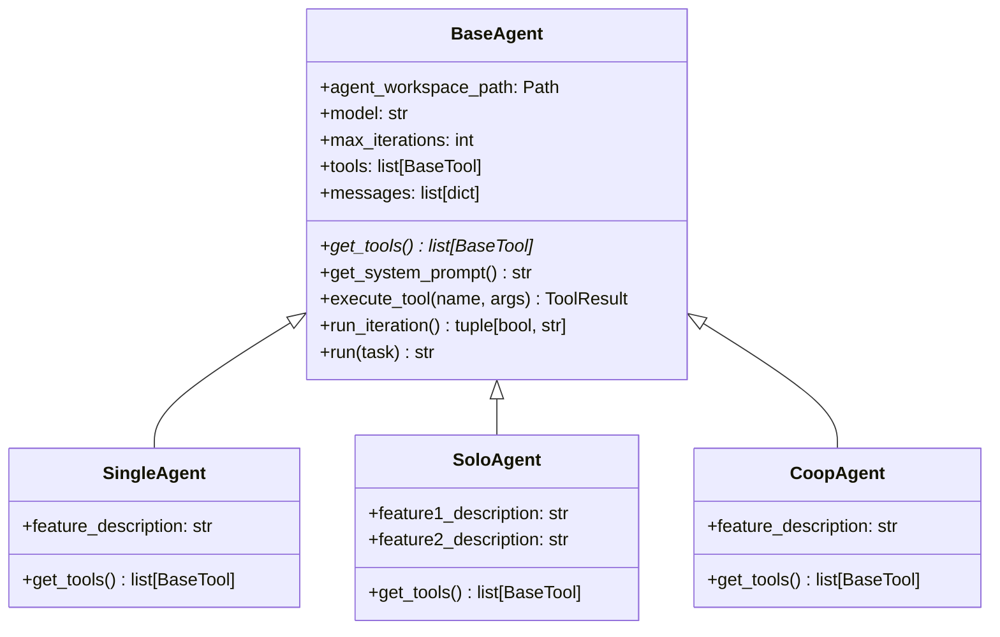
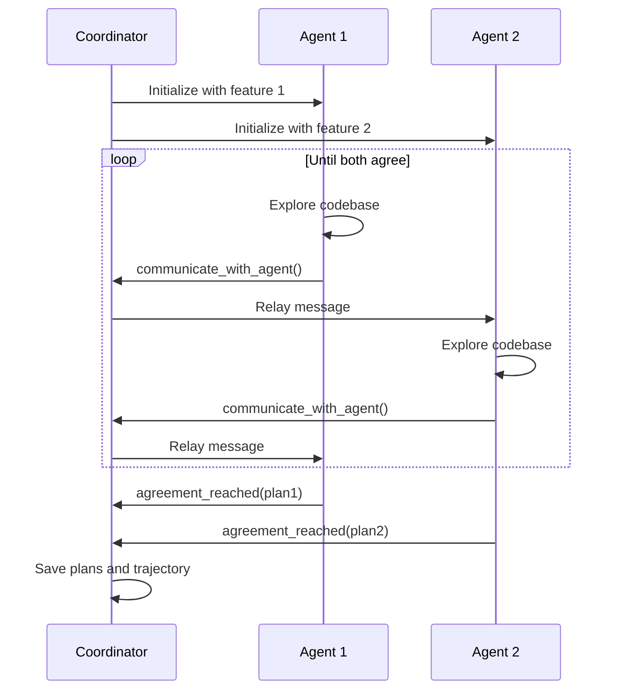

# System Design

This document explains the design decisions and architecture of CooperBench.

## Design Principles

1. **Clean Separation**: Each phase (planning, execution, evaluation) is independent
2. **Setting-Agnostic Core**: Core utilities work across all experiment settings
3. **Minimal State**: FileInterface is the single source of truth
4. **Reproducibility**: All randomness is controlled via the `k` parameter

## Module Structure

```
cooperbench/
    __init__.py         # Public API: BenchSetting, FileInterface
    cli.py              # Command-line interface
    
    core/               # Setting-agnostic utilities
        settings.py     # BenchSetting enum
        paths.py        # Path conventions and file naming
        git.py          # Git operations (worktrees, commits)
        patch.py        # Patch generation and application
        merge.py        # Merge operations and conflict analysis
        logger.py       # Structured logging
        huggingface.py  # HuggingFace Hub integration
        interface.py    # FileInterface class
    
    llm/                # LLM abstraction
        client.py       # Unified LLM API via litellm
    
    planning/           # Planning phase
        tools.py        # Agent tools (list_files, read_file, etc.)
        agent.py        # BaseAgent class
        trajectory.py   # Trajectory logging
        plan.py         # Planning entrypoint
        single.py       # Single-agent planning
        solo.py         # Solo (dual-feature) planning
        coop.py         # Cooperative planning
        templates/      # Jinja2 prompt templates
    
    execution/          # Execution phase (OpenHands integration)
    evaluation/         # Evaluation phase (tests, merge analysis)
    serve/              # Cloud deployment (Modal)
```

## Core Components

### BenchSetting Enum

Type-safe experiment settings:

```python
class BenchSetting(str, Enum):
    SINGLE = "single"
    SOLO = "solo"
    COOP = "coop"
    COOP_ABLATION = "coop_ablation"
```

Inherits from `str` for easy serialization and comparison.

### FileInterface

Central coordinator that manages:

- **Task Configuration**: repo_name, task_id, feature_ids, models, k
- **File Paths**: Deterministic naming via `get_file_paths()`
- **Workspace Setup**: Git worktrees via `setup_filesystem()`
- **I/O Operations**: Load/save plans, patches, trajectories
- **HuggingFace Sync**: Upload results with optional deferral

Key methods:

```python
interface.setup_filesystem()           # Initialize git worktrees
interface.get_feature_description()    # Load feature.md
interface.save_plan(plan, first=True)  # Save implementation plan
interface.apply_patch(location, first) # Apply patch to workspace
```

### Planning Agent Architecture



### Tool System

All tools inherit from `BaseTool`:

```python
class BaseTool(ABC):
    @abstractmethod
    def get_name(self) -> str: ...
    
    @abstractmethod
    def get_description(self) -> str: ...
    
    @abstractmethod
    def get_parameters(self) -> dict[str, Any]: ...
    
    @abstractmethod
    async def execute(self, **kwargs) -> ToolResult: ...
    
    def get_schema(self) -> dict[str, Any]:
        # Returns OpenAI function calling schema
```

Tools available:

| Tool | Description | Available In |
|------|-------------|--------------|
| `list_files` | Directory listing | All |
| `read_file` | File content with line numbers | All |
| `grep_search` | Regex search across files | All |
| `agreement_reached` | Submit final plan | All |
| `communicate_with_agent` | Inter-agent messaging | Coop only |
| `dual_agreement_reached` | Submit plans for both features | Solo only |

## Coordination Protocol (Coop Mode)



## Path Conventions

All paths follow deterministic patterns:

```python
# Task folder
dataset/{repo_name}/task{task_id}/

# Feature folder
dataset/{repo_name}/task{task_id}/feature{feature_id}/

# Agent workspace (single)
dataset/.../agent_workspace/{repo_name}_feature{f1}_k{k}/

# Agent workspace (multi-feature)
dataset/.../agent_workspace/{repo_name}_feature{f1}_feature{f2}_k{k}/

# Output directory
logs/{setting}/{repo_name}/task{task_id}/feature{i}[_feature{j}]/
```

## Error Handling

The system uses a fail-fast approach:

1. **Validation at Construction**: FileInterface validates settings at init
2. **Clear Error Messages**: Specific errors for missing files, invalid paths
3. **Graceful Degradation**: Planning forces agreement if max iterations reached

## Extension Points

To add a new planning mode:

1. Create agent class inheriting from `BaseAgent`
2. Implement `get_tools()` and `get_system_prompt()`
3. Create `run_planning()` function
4. Add routing in `planning/plan.py`
5. Add template in `planning/templates/`
