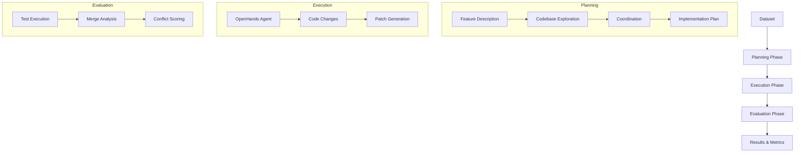

# Overview

CooperBench is a benchmark framework for evaluating multi-agent coordination in code collaboration scenarios. It measures how well AI agents can work together on shared codebases without creating merge conflicts.

## The Problem

When multiple developers work on the same codebase, they often create merge conflicts - situations where their changes overlap and cannot be automatically combined. This is a significant challenge for AI coding assistants that work in parallel.

CooperBench addresses this by:

1. Providing standardized tasks with parallel feature requests
2. Measuring agents' ability to coordinate their changes
3. Evaluating both individual feature correctness and merge compatibility

## Architecture

## Key Components

### FileInterface

The central coordinator for experiment state:

- Manages file paths and naming conventions
- Handles workspace setup (git worktrees)
- Coordinates saving/loading to HuggingFace

### Planning Tools

Agents use a set of tools to explore codebases:

- `list_files` - Directory listing
- `read_file` - File content with line numbers
- `grep_search` - Pattern search across files
- `communicate_with_agent` - Inter-agent messaging (coop mode)
- `agreement_reached` - Submit final plan

### TrajectoryLogger

Captures complete experiment trajectories:

- All LLM calls and responses
- Tool executions and results
- Coordination events between agents
- Final implementation plans

## Workflow

1. **Setup**: Initialize workspace from dataset repository
2. **Planning**: Agents explore codebase and create implementation plans
3. **Execution**: Plans are executed to generate code changes
4. **Evaluation**: Test correctness and merge compatibility
