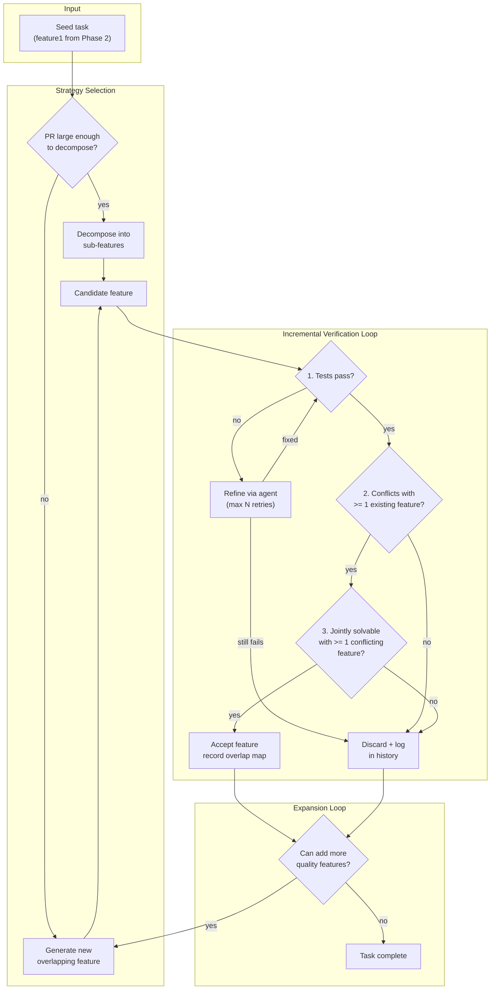

# Phase 3: Feature Pair Generation with Incremental Verification

## The Problem

Phase 2 gives us **seed features** (single PR turned into `task{N}/feature1/`). CooperBench needs **feature sets** where at least some pairs conflict on merge but are jointly solvable. The existing `generation/` pipeline checks tests and conflicts but **not joint solvability**. We need to close that gap and build an incremental, quality-controlled expansion loop.

## High-Level Architecture



## Two Strategies for Getting Features

### Strategy A: Decompose a large PR

If the seed PR is large (many files, many logical changes), an LLM can attempt to break it into smaller, independently-testable sub-features that naturally overlap. Each sub-feature gets its own `feature.patch`, `tests.patch`, and `feature.md`.

- **When to use**: Patch touches >= 3 files AND >= 50 lines of non-test code AND the LLM judges it contains multiple logical changes.
- **How it works**: Give the LLM the full patch + tests and ask it to propose a decomposition plan. For each sub-feature, it produces a subset of the patch with corresponding test subsets. Each goes through the verification loop.
- **Not forced**: If the LLM can't find a clean decomposition, fall back to Strategy B.

### Strategy B: Generate new overlapping features

This is closer to what the existing `generation/generator.py` does: given existing features, an LLM agent writes a new feature that modifies overlapping code regions. The key difference from today is that the agent has access to **deterministic verification scripts** and must iterate until they pass.

### Combined mode

Run decomposition first (if applicable), then generate additional overlapping features. Each new feature is verified before the next is attempted.

## The Verification Script (Deterministic)

A new module: `src/cooperbench/generation/verify.py`

This is a **deterministic, non-LLM** script that the agent can call. It takes a candidate feature and runs three checks:

### Check 1: Tests pass
Apply the candidate's `feature.patch` + `tests.patch` to the base image, run pytest. Binary pass/fail. Uses the existing `run_tests_in_sandbox()` from `src/cooperbench/generation/validator.py` or the Docker-based `validate_task()` from `src/cooperbench/generation/onboard.py`.

### Check 2: Merge conflicts exist
For each existing feature, try `git merge` of the candidate with that feature. Report which pairs conflict. Uses the existing `check_conflicts_in_sandbox()` from `src/cooperbench/generation/validator.py`. At least one conflict required.

### Check 3: Joint solvability (NEW)
For each conflicting pair (candidate + existing feature X):
1. Apply feature X's patch, commit on branch A
2. Apply candidate's patch, commit on branch B
3. Merge A into B (will have conflicts)
4. Give the merge-conflict state to a **resolver agent** (or use a simple heuristic merge for obvious cases)
5. Run BOTH test suites (feature X's tests + candidate's tests)
6. If both pass: the pair is **jointly solvable**

The solvability check itself uses an LLM agent internally (to resolve the conflict), but the **interface** is deterministic: you pass in two features, you get back "solvable" or "not solvable" with the resolution patch.

At least one conflicting pair must be jointly solvable for the candidate to be accepted.

## Agent-in-the-Loop Design

The generation agent (mini-swe-agent) gets a modified prompt that includes:

1. The task description (existing features, code context) -- same as today
2. **Access to the verification script** as a tool it can call inside the sandbox
3. Instructions to iterate: "After writing your feature and tests, run `python verify.py --check all`. If any check fails, read the output, fix your code, and re-run. Do not submit until all checks pass."

This means the agent does its own quality control loop internally, rather than us running the agent, getting output, validating externally, and retrying from scratch. The agent keeps its context and can make targeted fixes.

If the agent exhausts its step/cost budget without passing verification, we log the attempt in history and start a fresh attempt (possibly with different prompt guidance based on what went wrong).

## State and History Tracking

Each task maintains an expansion log:

```
dataset/flask_task/task5955/
    feature1/          (seed from Phase 2)
    feature2/          (accepted)
    feature3/          (accepted)
    expansion_log.json  (full history)
```

`expansion_log.json` tracks:
- Accepted features: which pairs conflict, which are jointly solvable, resolution patches
- Rejected attempts: what was tried, why it failed (tests, conflicts, solvability), agent trajectory
- Overlap map: adjacency matrix of which features conflict with which
- Strategy used for each feature (decompose vs generate)

## Key Design Principles

- **Incremental**: One feature at a time. Verify fully before attempting the next.
- **Not forced**: If decomposition doesn't work, fall back. If generation keeps failing, stop gracefully rather than producing garbage.
- **Deterministic gate**: LLMs propose, deterministic scripts verify. No feature is accepted without passing all three checks.
- **Agent self-verification**: The agent has the verification tool in-loop so it can iterate, rather than external retry loops that lose context.
- **Tracked**: Every attempt (success or failure) is logged so we can analyze failure modes and improve prompts.

## Implementation Breakdown

- **3a**: Build `verify.py` -- the deterministic verification module (tests + conflicts + solvability check). Test on existing benchmark tasks that have known feature pairs. **[DONE]**
- **3b**: Build the solvability checker specifically -- resolver agent + dual test suite runner. Test on known-solvable pairs from the existing dataset. **[DONE]**
- **3c/3d**: Build the expansion orchestrator (`expand.py`) with the incremental loop and agent-in-the-loop validation via `validate_feature.sh`. Wire in `verify.py` for external verification and `resolve.py` for solvability. Tested on `pallets_click_task/task2068` (generated feature13, solvable with all 12 existing features). **[DONE]**
- **3e**: Add the decomposition strategy (`decompose.py`). Two-phase approach: LLM planning call decomposes a large feature into sub-features, then per-sub-feature MSA agents implement them iteratively with the same validation infrastructure as expand.py. Tested on `dspy_task/task8394` (decomposed feature4 into 2 sub-features: feature6 "Global Cache Statistics" solvable with 5 features, feature7 "Per-Call Cache Usage" solvable with 4 features). **[DONE]**

---

## Implementation Notes

### Phase 3a: `verify.py` (completed)

**Files changed:**

- `src/cooperbench/generation/verify.py` (new) -- deterministic verification module with three checks (tests, conflicts, joint solvability), `VerificationResult` dataclass, `verify_candidate()` entry point, and CLI.
- `src/cooperbench/eval/sandbox.py` -- refactored `test_merged()` to extract `merge_and_test()` as a reusable function that accepts a pre-existing sandbox. `test_merged()` now delegates to it.
- `src/cooperbench/eval/backends/docker.py` -- fixed `DockerBackend.create_sandbox()` to override the image entrypoint (`entrypoint=["/bin/bash"]`) so containers with a non-shell `ENTRYPOINT` (e.g. `runner.sh`) stay alive for exec-based workflows.

**Test results:**

| Test | Tests | Conflicts | Solvability | Notes |
|------|-------|-----------|-------------|-------|
| click task2068, f1 vs f2 | 68 passed | Conflict detected | Union merge, both_passed=false | Pair requires intelligent resolution (expected) |
| flask task5955, f1 vs self | 20 passed | Clean (same patch) | Skipped | Identical patches merge cleanly (expected) |
| flask task5939, tests-only | 133 passed | N/A | N/A | Individual `--check tests` mode works |

**Key finding:** Benchmark feature pairs in `pallets_click_task` are designed to require LLM-based conflict resolution -- the naive+union heuristic in `merge_and_test()` is insufficient. This confirms Phase 3b (resolver agent) is necessary for real solvability assessment.

### Phase 3e: `decompose.py` (completed)

**Files changed:**

- `src/cooperbench/generation/decompose.py` (new) -- two-phase decomposition pipeline:
  1. `_generate_decomposition_plan()`: cheap `litellm.completion()` call to analyse a feature patch and produce a structured plan of N sub-features (2--5).
  2. `decompose_feature()`: iterates over the plan, spinning up one MSA agent per sub-feature, reusing `VALIDATE_FEATURE_SH` and `_extract_patches_from_container()` from `expand.py`.
- Imports shared infrastructure from `expand.py` (`VALIDATE_FEATURE_SH`, `SETUP_SCRIPT`, `_LoggingAgent`, `_extract_patches_from_container`).
- Includes `_should_decompose()` heuristic gate (>= 3 files OR >= 50 non-test diff lines).

**Test results (dspy_task/task8394, decomposing feature4 -- 236 lines, 4 files):**

| Sub-feature | Feature ID | Tests | Conflicts | Solvable With | Cost |
|---|---|---|---|---|---|
| Global Cache Statistics Tracking | feature6 | Passed | 1,2,3,4,5 | 1,2,3,4,5 (all 5) | ~$0.02 gen + $0.18 resolve |
| Per-Call Cache Usage Tracking | feature7 | Passed | 3,4,5,6 | 3,4,5,6 (all 4) | ~$0.25 gen + $0.38 resolve |

Total cost: $0.83. Both sub-features accepted and saved to dataset with resolution patches.
