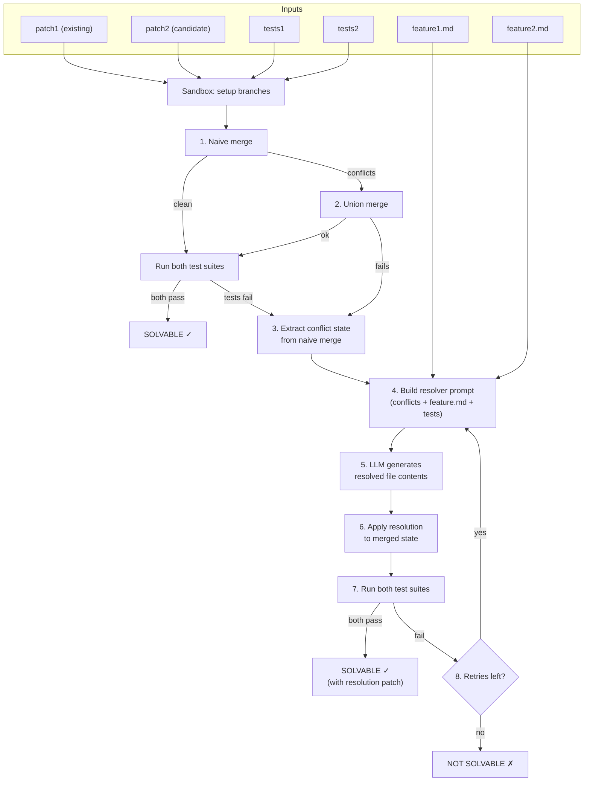

# Phase 3b: LLM-Based Conflict Resolver for Solvability Checking

## Context

Phase 3a built `verify.py` with three deterministic checks. Check 3 (joint solvability) currently tries naive merge then union merge fallback. Testing on `pallets_click_task/task2068` f1 vs f2 showed that union merge produces code that compiles but fails tests -- the features require *intelligent* conflict resolution, not textual merging.

Without a resolver, the expansion orchestrator (3c) will reject almost all generated features at the solvability gate, because any pair that truly conflicts in interesting ways won't pass automatic merging. Phase 3b adds an LLM-based resolver so `check_solvability()` can determine whether a conflict is *resolvable*, not just *auto-mergeable*.

## What We Are Building

A new module `src/cooperbench/generation/resolve.py` that:

1. Takes two conflicting patches (with their test suites) and a Docker image
2. Attempts automatic merge (naive + union, reusing existing infra)
3. If tests fail, extracts the conflict state and asks an LLM to resolve it
4. Applies the LLM's resolution and re-runs both test suites
5. Returns whether the pair is solvable + the resolution patch

Then integrate it into `verify.py::check_solvability()` as an optional fallback.

## Architecture



## Key Design Decision: Single-Turn LLM vs. Full Agent

**We start with a single-turn LLM approach** (direct `litellm.completion()` call) rather than spawning a full `mini_swe_agent`:

| | Single-turn LLM | Full agent |
|---|---|---|
| **Cost** | ~$0.01-0.05 per resolution | ~$0.50-2.00 per resolution |
| **Speed** | 5-15 seconds | 2-10 minutes |
| **Capability** | Resolves most textual/semantic conflicts | Can handle complex multi-file refactoring |
| **Iteration** | We retry the LLM call with error feedback (cheap) | Agent iterates internally (expensive) |
| **When to use** | Phase 3b (default) | Phase 3d (agent-in-the-loop, for hard cases) |

The single-turn approach mirrors the pattern already used in `onboard.py::generate_feature_md()`: build a system prompt + user message with context, call `litellm.completion()`, parse the response.

If the single-turn resolver fails after N retries, we report "not solvable" (for now). Phase 3d can later escalate to a full agent.

## Concrete Implementation

### `resolve.py` module structure

```python
# src/cooperbench/generation/resolve.py

@dataclass
class ResolutionResult:
    resolved: bool
    resolution_patch: str          # git diff of the resolved merge
    merge_strategy: str            # "naive", "union", or "llm"
    both_passed: bool
    feature1_passed: bool
    feature2_passed: bool
    llm_attempts: int              # 0 if auto-merge worked
    llm_cost: float
    error: str | None

def resolve_conflict(
    repo_name: str,
    task_id: int,
    patch1: str, patch2: str,
    tests1: str, tests2: str,
    feature_md1: str | None = None,
    feature_md2: str | None = None,
    max_llm_retries: int = 3,
    model_name: str = "gemini/gemini-2.0-flash",
    timeout: int = 600,
    backend: str = "docker",
) -> ResolutionResult:
    """Full resolution pipeline: auto-merge → LLM fallback → test."""
```

### Step-by-step flow inside `resolve_conflict()`

**Step 1-2: Try auto-merge (reuse existing infra)**
- Call `merge_and_test()` from `sandbox.py`
- If `both_passed`: return immediately with `merge_strategy="naive"` or `"union"`

**Step 3: Extract conflict state**
- Re-run the naive merge *without* aborting on conflict
- Capture the files with `<<<<<<<` / `=======` / `>>>>>>>` markers
- Also capture the clean (non-conflicting) parts of the merge
- New helper: `_extract_conflict_state(sb, base_sha) -> dict` with:
  - `conflicted_files`: dict of `{filepath: content_with_markers}`
  - `clean_diff`: the parts that merged cleanly

**Step 4-5: LLM resolution**
- Build a prompt with:
  - System: "You are a merge conflict resolver. Given files with conflict markers, produce the resolved version."
  - User: the conflicted files, both feature descriptions, and relevant test snippets
  - Output format: JSON with `{filepath: resolved_content}` for each conflicted file
- Call `litellm.completion()` with `response_format={"type": "json_object"}`
- Parse the response

**Step 6: Apply resolution**
- In the sandbox, write the resolved files over the conflicted ones
- Stage and commit
- Generate a diff against the base SHA → this is the `resolution_patch`

**Step 7: Test**
- Run both test suites against the resolved merge (reuse `_run_tests()`)
- If both pass: done
- If tests fail: retry from Step 4 with the test output as feedback

### Prompt Design

```
SYSTEM:
You are a merge conflict resolver for a software project. You are given
files with git merge conflict markers (<<<<<<< / ======= / >>>>>>>) and
descriptions of two features that were independently developed.

Your job is to produce a resolved version of each conflicted file that
correctly implements BOTH features. The resolution must:
1. Preserve all functionality from Feature 1
2. Preserve all functionality from Feature 2
3. Not break any existing functionality
4. Result in valid, well-structured code

Return a JSON object where keys are file paths and values are the full
resolved file contents (not diffs, not just the conflicted sections --
the complete file).

USER:
## Feature 1
{feature_md1 or "No description available."}

## Feature 2
{feature_md2 or "No description available."}

## Conflicted Files
{for each file: "### filepath\n```\nfile_with_markers\n```"}

## Test Expectations
Feature 1 tests: {test_file_list_1}
Feature 2 tests: {test_file_list_2}

{if retry: "## Previous Attempt Failed\nTest output:\n{test_output}"}
```

### Integration with `verify.py`

Add an optional `resolve` parameter to `check_solvability()` and `verify_candidate()`:

```python
def check_solvability(
    ...,
    resolve: bool = False,          # NEW
    model_name: str = "gemini/gemini-2.0-flash",  # NEW
    max_llm_retries: int = 3,       # NEW
) -> dict:
    # Existing: try merge_and_test()
    # If both_passed: return solvable
    # NEW: if not both_passed and resolve=True:
    #   call resolve_conflict(...)
    #   return based on resolution result
```

CLI addition:
```bash
python -m cooperbench.generation.verify \
    --task pallets_click_task/task2068 \
    --candidate-feature 1 --against 2 \
    --check solvability \
    --resolve --model gemini/gemini-2.0-flash \
    --backend docker
```

## Testing Strategy

### Test 1: Known benchmark pair (click f1 vs f2)
- This is the pair that passed checks 1+2 but failed check 3 in Phase 3a
- Expected: LLM resolves the conflict, both test suites pass
- This validates the full pipeline

### Test 2: Multiple pairs from click task2068
- Try f1 vs f3, f1 vs f4, etc. to measure resolution success rate
- Expected: most pairs should be resolvable since they're in the benchmark

### Test 3: Negative case
- Create a deliberately unsolvable pair (mutually exclusive implementations)
- Expected: LLM fails to resolve, correctly reports not solvable

## Task Breakdown

1. **`resolve-dataclass`**: Define `ResolutionResult` dataclass, create `resolve.py` skeleton with `resolve_conflict()` signature
2. **`extract-conflicts`**: Implement `_extract_conflict_state()` -- re-run naive merge without aborting, capture conflicted files with markers
3. **`resolver-prompt`**: Design and implement the LLM resolver prompt + `litellm.completion()` call with JSON response parsing
4. **`apply-and-test`**: Implement applying the LLM's resolved files to the sandbox, generating the resolution diff, and testing both suites
5. **`resolve-loop`**: Wire up the retry loop (auto-merge → LLM fallback → test → retry with feedback)
6. **`integrate-verify`**: Add `--resolve` flag to `check_solvability()` and CLI
7. **`test-click-pair`**: Test on `pallets_click_task/task2068` f1 vs f2
8. **`test-multiple-pairs`**: Test on additional click pairs to measure success rate
